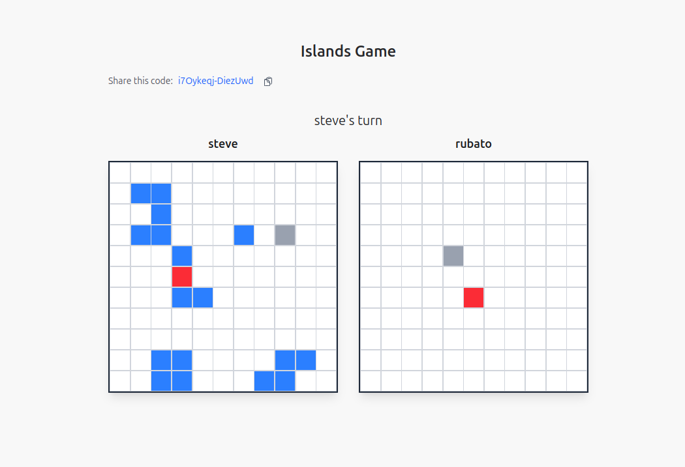

# Islands Duel

Islands Duel is a two-player strategy game built with Phoenix LiveView. Players place islands on their boards and take turns guessing coordinates on their opponent's board to find and "forest" all of the opponent's islands. The first player to forest all of their opponent's islands wins.

## About

The game engine in this project is based on the excellent book [*Functional Web Development with Elixir, OTP, and Phoenix*](https://pragprog.com/titles/lhelph/functional-web-development-with-elixir-otp-and-phoenix/) by Lance Halvorsen. The book teaches you how to build a stateful game engine using pure Elixir functions, GenServer, OTP, and Supervisors.

## Features

- **Real-time gameplay**: Uses Phoenix LiveView to synchronize game state in real-time between two players
- **Game state management**: Uses GenServer and DynamicSupervisor to manage multiple concurrent games
- **Random island placement**: Automatically places islands randomly when starting a game
- **Turn-based logic**: Turn-based logic between two players managed by a state machine

## Installation and Running

To start your Phoenix server:

* Run `mix setup` to install and setup dependencies
* Start Phoenix endpoint with `mix phx.server` or inside IEx with `iex -S mix phx.server`

Now you can visit [`localhost:4000`](http://localhost:4000) from your browser.

Ready to run in production? Please [check our deployment guides](https://hexdocs.pm/phoenix/deployment.html).

## Learn more

* Official website: https://www.phoenixframework.org/
* Guides: https://hexdocs.pm/phoenix/overview.html
* Docs: https://hexdocs.pm/phoenix
* Forum: https://elixirforum.com/c/phoenix-forum
* Source: https://github.com/phoenixframework/phoenix
